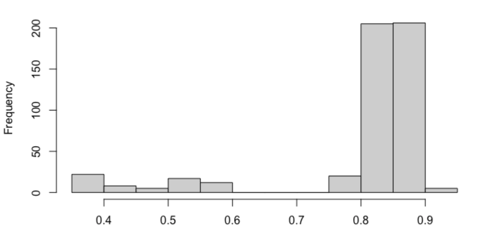
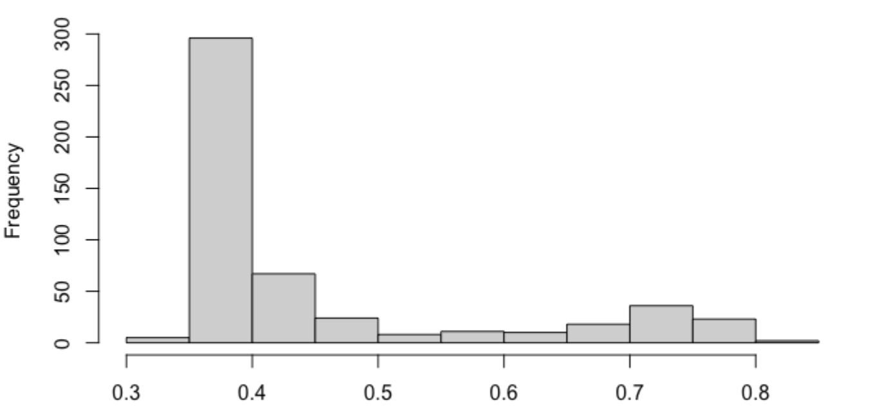
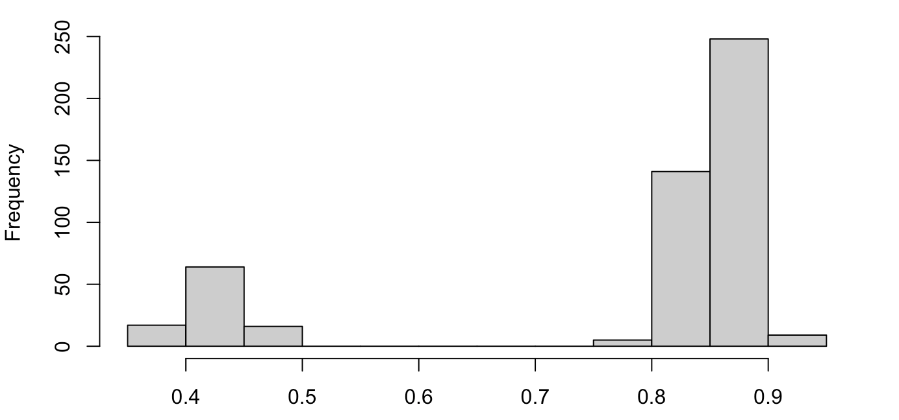
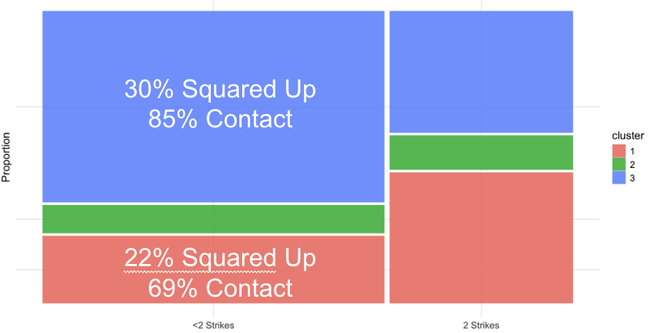

**Tai Fowler** · Senior Thesis in Mathematics, Pomona College · Advisor: Dr. Johanna Hardin

[Read the full thesis (PDF)](media/tai_fowler_thesis.pdf){.btn .btn-primary target="_blank"}

## The question

Do hitters have more than one swing?

Players have long talked about changing their swing for the situation. The best-known example is
the "two-strike approach," where a hitter shortens up to avoid striking out. Bryce Harper put it
this way: he has "more clubs in the bag."

Baseball Savant recently released five new bat tracking metrics: **bat speed**, **swing length**,
**attack angle**, **attack direction**, and **swing path tilt**. For the first time, a swing can be
described with numbers rather than words like "flat" or "long." My thesis asks whether those
numbers show statistical evidence that a batter has distinct swing types.

## The method: Gaussian mixture models

If a hitter really has several swings, their swing data is a blend of several groups, but nobody
labels which swing is which. A **Gaussian mixture model** treats the data as a mix of bell-shaped
(Gaussian) groups and estimates what each group looks like and how often it appears. The
**Expectation–Maximization (EM) algorithm** fits the model by alternating between guessing which
group each swing belongs to and updating the groups to match.

The groups can be shaped in different ways: their size, shape, and orientation can each be the
same for every group or allowed to vary. That gives 14 possible covariance models, from the
simplest (EEE, every group identical) to the most flexible (VVV, every group different).

## Simulation study: which model should you pick?

In real data you don't know the true shape of the groups, so I tested what happens when you pick
the wrong model. I generated 3-D data sets of 900 points from several known structures (VEE, EVE,
EEV, and a 6-group case) and clustered each one three ways:

- with the **correct** model, as a control
- with the simpler **EEE** model, which underfits
- with the more flexible **VVV** model, which overfits

I repeated this 500 times per scenario and scored each result with the **Adjusted Rand Index**
(ARI), where 1 means the true groups were recovered perfectly and 0 means no better than random.

::: {.callout-note title="Simulation results"}
- **Overfitting held up well.** VVV produced ARI distributions close to the correct-model control.
  On EVE data, about 80% of VVV fits scored between 0.8 and 0.9.
- **Underfitting hurt.** EEE scored much lower, with about 70% of fits between 0.35 and 0.45 on
  the same data.
- **Complexity has limits.** With 6 groups, accuracy dropped for every model, including the
  correct one.
:::

::: {#fig-sim layout-ncol=1}

{#fig-sim-correct fig-alt="Histogram of ARI scores for EVE data clustered with the correct EVE model. Most of the 500 data sets score between 0.8 and 0.9, with a small group below 0.6."}

{#fig-sim-eee fig-alt="Histogram of ARI scores for EVE data clustered with the simpler EEE model. Most data sets score between 0.35 and 0.45."}

{#fig-sim-vvv fig-alt="Histogram of ARI scores for EVE data clustered with the flexible VVV model. Most data sets score between 0.8 and 0.9, with a small group near 0.4."}

ARI scores for 500 simulated EVE data sets under each clustering model. The flexible VVV model
recovers the groups almost as well as the correct model, while the simpler EEE model mostly
scores around 0.4. The horizontal axes differ slightly between panels.
:::

## Application: Jose Altuve's swings

I applied a VVV model with three clusters to **1,136 swings** by Jose Altuve from the 2025 MLB
season, using all five bat tracking metrics (normalized). I then compared the clusters across game
situations.

- **One cluster looks like his "A" swing.** It squared up the ball 30% of the time and made
  contact 85% of the time. It appeared most often with fewer than two strikes, against fastballs,
  and on pitches in the middle of the zone.
- **Another looks like a less comfortable "B" swing.** It squared up the ball only 22% of the time
  and made contact 69% of the time. It appeared most often with two strikes, against off-speed
  and breaking pitches, and on pitches low and away.

{#fig-altuve fig-alt="Mosaic chart of Jose Altuve's swings split by count. With fewer than two strikes, cluster 3 (30% squared up, 85% contact) makes up most swings; with two strikes, cluster 1 (22% squared up, 69% contact) makes up most swings."}

For Altuve at least, the data supports the idea that he uses more than one swing and that his
choice responds to the game situation.

## Limitations and next steps

- I chose three clusters for interpretability. A formal criterion such as BIC should decide the
  number of swing types.
- The analysis covers one player. Repeating it across the league could show whether there are
  common swing archetypes.
- Bat tracking data only spans a short period, so more seasons would strengthen the results.

*All analysis was done in R, mainly with `mclust`, `tidyverse`, and `ggplot2`.*
